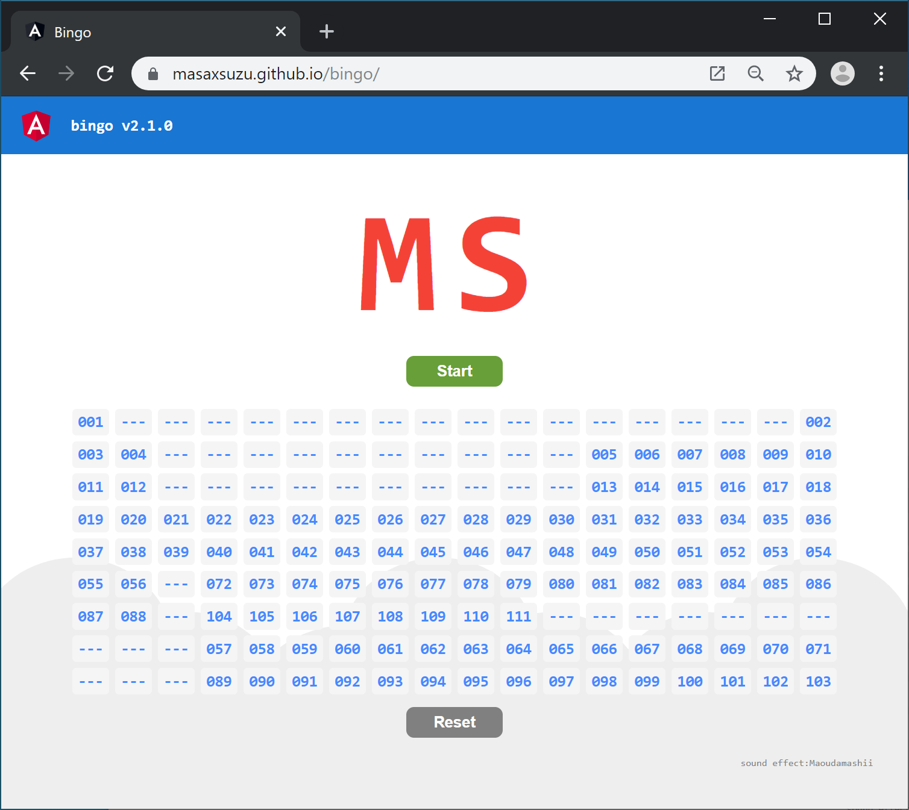

# Bingo

[](https://github.com/masaxsuzu/bingo/actions) [](https://codebeat.co/projects/github-com-masaxsuzu-bingo-master)

1から111までの数を周期表上に表示するビンゴです。



## 公開場所

[github pages](https://masaxsuzu.github.io/bingo/index.html)で利用可能です。

## 使い方

- スタートボタンを押すとルーレットが始まります。
- ドラムロールが5秒ほど流れます。
- リセットボタンを押すことでルーレット結果を初期化するモーダルを表示します。その後"Ok"ボタンを押すと結果をリセットします。
- ルーレットの結果は[ローカルストレージ](https://developer.mozilla.org/ja/docs/Web/API/Window/localStorage)に保存しているため、再読み込みをしても直前の状態に復元されます。  
- Google Chrome 67+を使用している場合は、デスクアップアプリとしてインストールが可能です。([インストール方法](./docs/install.md))

## 動作環境

### ディスプレイ

最適なディスプレイサイズは1600x900です。

それよりも大きな画面の場合は、ブラウザの拡大機能で調整をしてください。

それよりも小さい画面の場合、周期表のレイアウトが崩れる、一画面に収まらないなどの問題が発生します。

### ブラウザ

#### デスクトップ

推奨ブラウザは```Google Chrome```です。開発および自動テストで使用しています。

```Edge```では簡単な動作の確認をしています。

```Safari```、```Firefox```では動作の確認をしていません。

```Internet Explorer```では動作しないことを確認しています。

#### モバイル

動作の確認をしていません。

## Author

[masaxsuzu](https://github.com/masaxsuzu)

This repository is inspired by 

- [sifue](https://github.com/sifue/partybingo)
- [syumai](https://github.com/syumai/partybingo)

## License

MIT
